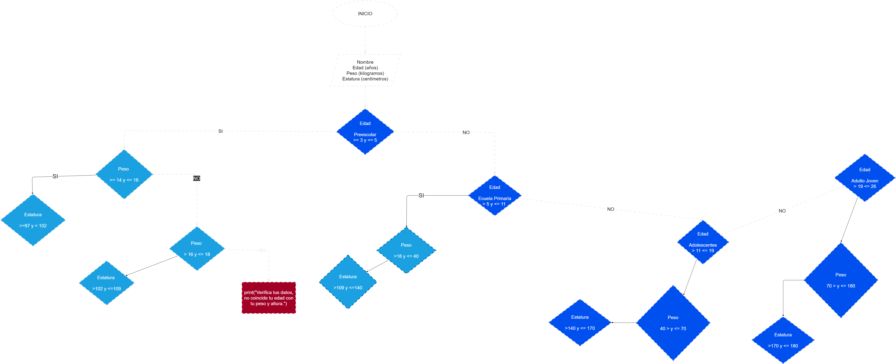

# Nuestro programa tendrá como función principal, buscar generar en las personas que lo usen, una mejoría de su salud tanto física como mental.

### -----------------------------------------------------------------------

### Podrá tomar los datos de quién la use, para así analizar cuantas calorías debe consumir, que tipo de alimentos pueden ayudarle a llegar a ese tope con el que puede mejorar su salud y de esta manera no consumir nada en exceso.

### -----------------------------------------------------------------------

### Nos basaremos en las dietas que se necesitan para poder tener un cuerpo totalmente sano.

### -----------------------------------------------------------------------

### Le indicará las horas de sueño que tiene, y también cuantas exactamente debe tener para un buen funcionamiento de su cuerpo.

### -----------------------------------------------------------------------

### Y por último podrá disponer de una serie de ejercicios que son muy recomendables para desarrollar diariamente, lo cual generará en su cuerpo una mayor cantidad de energía. 

